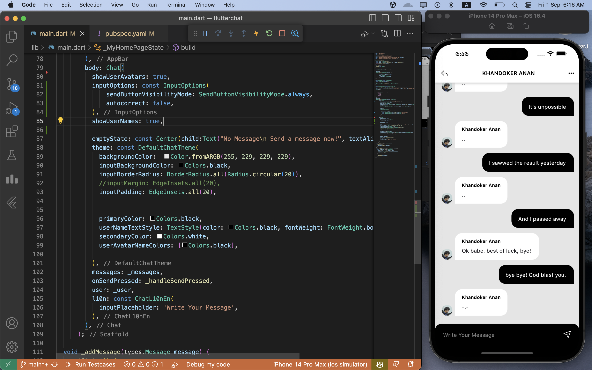

# Flutter Chat UI with Firebase Integration for Seamless Messaging
Dive into a world of smooth communication with our advanced Flutter Chat UI. Carefully created, it gives users an amazing messaging experience. Balanced between looking good and working well, this Flutter Chat UI helps users connect, chat, and share without a hitch. It's just what you need for today's communication.

With a friendly design, you'll find it easy to use. Chat happens instantly, thanks to our connection with Firebase's smart technology. And your chats are secure and always available.

You can make your profile special with pictures and names you like. Share photos, videos, and more to bring conversations to life. Emojis and reactions add fun to your chats. And you'll always know when your message is seen or delivered.

No matter the device, our Flutter Chat UI looks great. Whether you're making a social app, a work group chat, or something new, our UI, combined with Firebase, makes things easy.

Let this Flutter Chat UI transform how you chat. Start today and give your users a top-notch messaging experience. Get ready for smooth communication powered by the latest tech.

# Screenshot

# Dependencies
flutter_chat_ui: ^1.6.9
cupertino_icons: ^1.0.6
